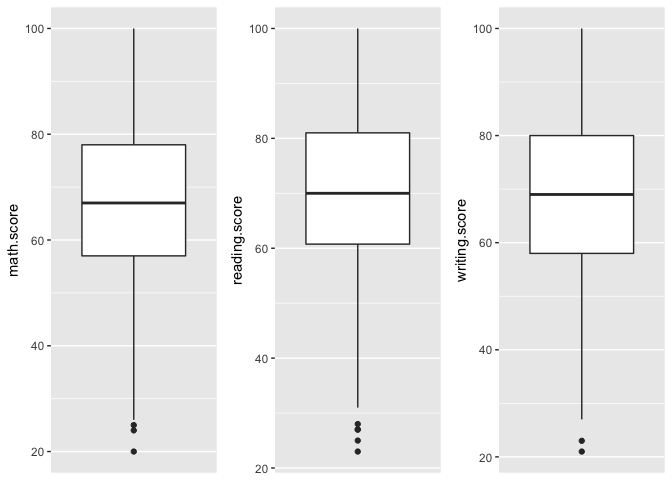
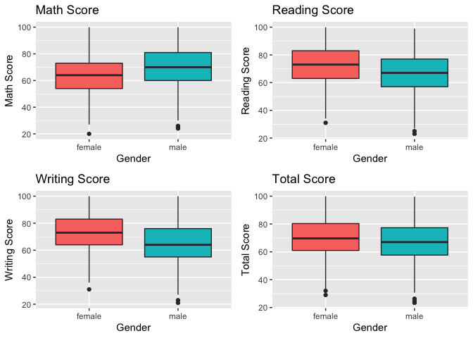
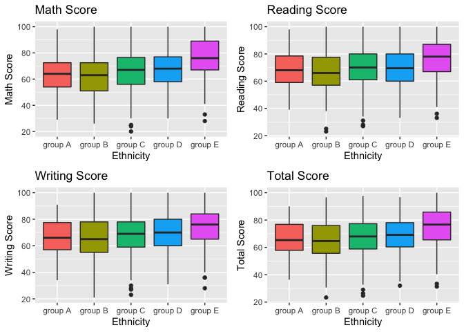
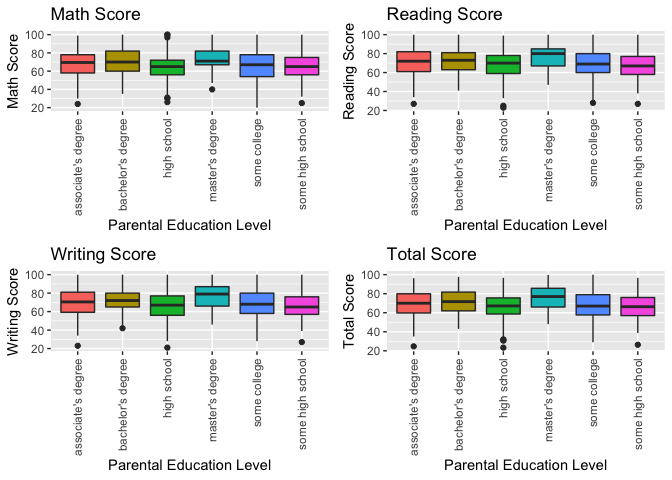
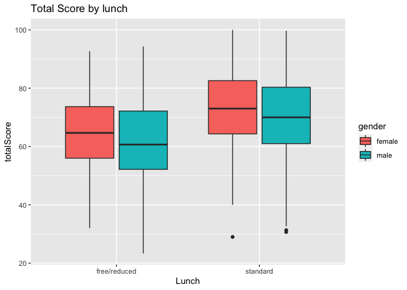
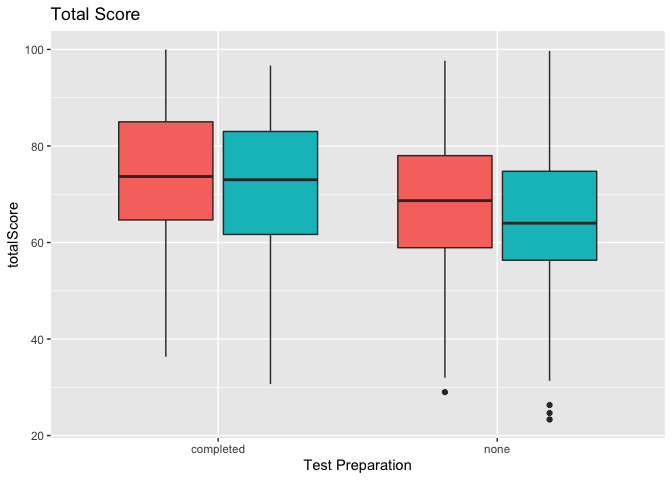

Students Performance
================

## Import libraries

``` r
library(readr)
library(tidyverse)
library(caTools)
library(randomForest)
library(ggpubr)
library(caret)
library(e1071)
```

## Import dataset

``` r
df <- read.csv('exams.csv', header = TRUE, sep = ',')
head(df)
```

    ##   gender race.ethnicity parental.level.of.education        lunch
    ## 1 female        group C            some high school     standard
    ## 2 female        group C          associate's degree     standard
    ## 3 female        group C                 high school     standard
    ## 4   male        group E           bachelor's degree     standard
    ## 5   male        group B                some college     standard
    ## 6 female        group D                 high school free/reduced
    ##   test.preparation.course math.score reading.score writing.score
    ## 1                    none         53            68            58
    ## 2                    none         76            77            81
    ## 3                    none         62            81            78
    ## 4                    none         89            78            78
    ## 5                    none         56            70            60
    ## 6                    none         66            71            72

``` r
summary(df)
```

    ##     gender          race.ethnicity     parental.level.of.education
    ##  Length:1000        Length:1000        Length:1000                
    ##  Class :character   Class :character   Class :character           
    ##  Mode  :character   Mode  :character   Mode  :character           
    ##                                                                   
    ##                                                                   
    ##                                                                   
    ##     lunch           test.preparation.course   math.score    reading.score   
    ##  Length:1000        Length:1000             Min.   : 20.0   Min.   : 23.00  
    ##  Class :character   Class :character        1st Qu.: 57.0   1st Qu.: 60.75  
    ##  Mode  :character   Mode  :character        Median : 67.0   Median : 70.00  
    ##                                             Mean   : 66.9   Mean   : 70.06  
    ##                                             3rd Qu.: 78.0   3rd Qu.: 81.00  
    ##                                             Max.   :100.0   Max.   :100.00  
    ##  writing.score  
    ##  Min.   : 21.0  
    ##  1st Qu.: 58.0  
    ##  Median : 69.0  
    ##  Mean   : 68.8  
    ##  3rd Qu.: 80.0  
    ##  Max.   :100.0

``` r
nrow(df)
```

    ## [1] 1000

There are 1000 entries of students with information on gender,
ethnicity, parental education, lunch, test preparation, math score,
reading score and writing score.

Let’s check if there are missing values.

``` r
df[!complete.cases(df),]
```

    ## [1] gender                      race.ethnicity             
    ## [3] parental.level.of.education lunch                      
    ## [5] test.preparation.course     math.score                 
    ## [7] reading.score               writing.score              
    ## <0 rows> (or 0-length row.names)

No missing values.

## Exploratory Analysis

``` r
table(df$gender)
```

    ## 
    ## female   male 
    ##    515    485

515 students are female, 485 are male.

``` r
table(df$race.ethnicity)
```

    ## 
    ## group A group B group C group D group E 
    ##      75     183     323     276     143

Five different ethnicity groups, denoted by A to E. Group C is the
biggest group containing 319 students.

``` r
table(df$parental.level.of.education)
```

    ## 
    ## associate's degree  bachelor's degree        high school    master's degree 
    ##                182                135                194                 73 
    ##       some college   some high school 
    ##                215                201

Five different parental education level: Associate’s degree, Bachelor’s
degree, high school, Master’s degree, some college and some high school.
“Some college” and Associate’s degree have the most occurences with 226
and 222.

``` r
table(df$lunch)
```

    ## 
    ## free/reduced     standard 
    ##          352          648

The variable ‘lunch’ has two characteristics: standard lunch and
free/reduced lunch. Most students (645) have standard lunch.

``` r
table(df$test.preparation.course)
```

    ## 
    ## completed      none 
    ##       320       680

Binary variable. 642 students did not do the test preparation course.

``` r
p1 <- ggplot(data = df, aes(x = factor(0), `math.score`)) + 
        geom_boxplot() + 
        scale_x_discrete(breaks = NULL) +
        xlab(NULL)
p2 <- ggplot(data = df, aes(x = factor(0), `reading.score`)) + 
        geom_boxplot() + 
        scale_x_discrete(breaks = NULL) +
        xlab(NULL)
p3 <- ggplot(data = df, aes(x = factor(0), `writing.score`)) + 
        geom_boxplot() + 
        scale_x_discrete(breaks = NULL) +
        xlab(NULL)
ggarrange(p1,p2,p3, ncol=3, nrow=1)
```

<!-- --> <br/> Scores
for each test are centered around 65-70.

Let’s create a total score variable which is the average of the 3
scores.

``` r
df$totalScore <- round((df$math.score + df$reading.score + df$writing.score)/3, digits = 2)
```

Let’s see if there is a difference between gender.

``` r
ggarrange(ggplot(data = df, aes(x = gender, y = `math.score`, fill = gender)) +
            geom_boxplot(show.legend = FALSE) +
            labs(title = "Math Score", y = "Math Score", x = "Gender"),
          ggplot(data = df, aes(x = gender, y = `reading.score`, fill = gender)) +
            geom_boxplot(show.legend = FALSE) +
            labs(title = "Reading Score", y = "Reading Score", x = "Gender"),
          ggplot(data = df, aes(x = gender, y = `writing.score`, fill = gender)) +
            geom_boxplot(show.legend = FALSE) +
            labs(title = "Writing Score", y = "Writing Score", x = "Gender"),
          ggplot(data = df, aes(x = gender, y = totalScore, fill = gender)) +
            geom_boxplot(show.legend = FALSE) +
            labs(title = "Total Score", y = "Total Score", x = "Gender"),
          ncol=2,
          nrow=2)
```

<!-- --> <br/> While
male students are better at math in general, female students beat them
at reading and writing. Female students are overall better.

Differences between ethnicities?

``` r
ggarrange(ggplot(df, aes(x = race.ethnicity, y = `math.score`, fill = race.ethnicity)) +
            geom_boxplot(show.legend = FALSE) +
            labs(title = "Math Score", x = "Ethnicity", y = "Math Score"),
          ggplot(df, aes(x = race.ethnicity, y = `reading.score`, fill = race.ethnicity)) +
            geom_boxplot(show.legend = FALSE) +
            labs(title = "Reading Score", x = "Ethnicity", y = "Reading Score"),
          ggplot(df, aes(x = race.ethnicity, y = `writing.score`, fill = race.ethnicity)) +
            geom_boxplot(show.legend = FALSE) +
            labs(title = "Writing Score", x = "Ethnicity", y = "Writing Score"),
          ggplot(df, aes(x = race.ethnicity, y = totalScore, fill = race.ethnicity)) +
            geom_boxplot(show.legend = FALSE) +
            labs(title = "Total Score", x = "Ethnicity", y = "Total Score"),
          ncol=2,
          nrow=2)
```

<!-- --> <br/> From
worst to best in each test: A \< B \< C \< D \< E

What about parental education?

``` r
ggarrange(ggplot(df, aes(x = parental.level.of.education, y = math.score, fill = parental.level.of.education)) +
            geom_boxplot(show.legend = FALSE) +
            labs(title = "Math Score", x = "Parental Education Level", y = "Math Score") +
            ggpubr::rotate_x_text(),
          ggplot(df, aes(x = parental.level.of.education, y = reading.score, 
                         fill = parental.level.of.education)) +
            geom_boxplot(show.legend = FALSE) +
            labs(title = "Reading Score", x = "Parental Education Level", y = "Reading Score") +
            ggpubr::rotate_x_text(),
          ggplot(df, aes(x = parental.level.of.education, y = writing.score, 
                         fill = parental.level.of.education)) +
            geom_boxplot(show.legend = FALSE) +
            labs(title = "Writing Score", x = "Parental Education Level", y = "Writing Score") +
            ggpubr::rotate_x_text(),
          ggplot(df, aes(x = parental.level.of.education, y = totalScore, fill = parental.level.of.education)) +
            geom_boxplot(show.legend = FALSE) +
            labs(title = "Total Score", x = "Parental Education Level", y = "Total Score") +
            ggpubr::rotate_x_text(),
          nrow = 2,
          ncol = 2)
```

<!-- --> <br/> It
seems like there is an intergenerational transmission of educational
performance. Students whose parents have a master’s degree tend to have
higher scores than the rest. On the contrary, students whose parents
only have high school degree are the worst. This is the case for every
test.

Lunch?

``` r
ggplot(df, aes(x = lunch, y = totalScore, fill = gender)) +
  geom_boxplot() +
  labs(title = "Total Score by lunch", x = "Lunch")
```

<!-- --> Students
having standard lunch perform better in general.

Does the test preparation course help to achieve a higher score?

``` r
ggplot(df, aes(x = test.preparation.course, y = totalScore, fill = gender)) +
  geom_boxplot(show.legend = FALSE) +
  labs(title = "Total Score", x = "Test Preparation")
```

<!-- --> <br/> It does
help both for female and male students.

## Classification

**Can we build a classification model that is able to predict whether
the student is male or female given the other variables?**

Creating binary variables. Gender, lunch, test preparation receive 0 and
1 labels. The ethnicity and parental education variables are encoded by
one hot encoding.

``` r
df$gender0 <- factor(df$gender, levels = c("male", "female"), labels = c(0, 1)) 
df$lunch0 <- factor(df$lunch, levels = c("free/reduced", "standard"), labels = c(0, 1))
df$testPrep0 <- factor(df$test.preparation.course, levels = c("none", "completed"), labels = c(0, 1))

dmy <- dummyVars("~ race.ethnicity + parental.level.of.education", data = df)
df_2 <- data.frame(predict(dmy, newdata = df))
df_3 <- cbind(df, df_2)
```

Creating training and test set

``` r
set.seed(123)
split <- sample.split(df_3$gender0, SplitRatio = 0.8)
training_set <- subset(df_3, split == TRUE)
test_set <- subset(df_3, split == FALSE)

training_set <- training_set[, -c(1:5, 9)]
test_set <- test_set[, -c(1:5, 9)]
```

**Classifying gender** <br/> Fitting Logistic Regression to the training
set

``` r
classifier <- glm(formula = gender0 ~ .,
                  family = binomial,
                  data = training_set)
```

Predicting test set results

``` r
prob_pred <- predict(classifier, type = "response", newdata = test_set[, -4])
y_pred <- ifelse(prob_pred > 0.5, 1, 0)
```

Confusion Matrix

``` r
cm <- table(test_set[, 4], y_pred)
cm
```

    ##    y_pred
    ##      0  1
    ##   0 83 14
    ##   1 11 92

The gender of 175 (out of 200) students are predicted properly which
means an accuracy of 0.875.

**Classifying test preparation** <br/> Can we also predict if a student
did the test preparation?

``` r
classifier_2 <- glm(formula = testPrep0 ~ ., family = binomial, data = training_set)
```

Predicting test result

``` r
prob_pred_2 <- predict(classifier_2, type = "response", newdata = test_set[, -6])
y_pred_2 <- ifelse(prob_pred_2 > 0.5, 1, 0)
```

Confusion Matrix

``` r
cm_2 <- table(test_set[, 6], y_pred_2)
cm_2
```

    ##    y_pred_2
    ##       0   1
    ##   0 120  11
    ##   1  39  30

150 right predictions are made out of 200. As a result, the accuracy is
0.75. If we used a model that predicts 0 all the time, the accuracy
would be 0.655. Let’s try a non-linear classification model like Random
Forest.

``` r
classifier_3 <- randomForest(x = training_set[, -6], y = training_set$testPrep0, ntree = 10, importance = TRUE)
```

Predicting test set results

``` r
y_pred_3 <- predict(classifier_3, newdata = test_set[, -6])
```

Confusion Matrix

``` r
cm_3 <- table(test_set[, 6], y_pred_3)
cm_3
```

    ##    y_pred_3
    ##       0   1
    ##   0 116  15
    ##   1  55  14

The results are worse than those of the Logistic Regression classifier.
The accuracy is only 0.65. How can we improve? Considering we have
rather many features, we should probably use more trees in the model.
Let’s apply Grid Search to find the optimal parameters. The two most
important ones for Random Forest models are the number of trees and the
max number of features considered for splitting a node. The caret
package only allows us to tune the max number of features at each node.
Theoretically, the number of trees can be as large as we like, the
accuracy would increase. We would only be limited by computational time.
Also, we are doing label encoding for the variables ethnicity and
parental education instead of one-hot encoding as the latter tend to
decrease the accuracy in Random Forest models.

Label encoding of ethnicity and parental education

``` r
df$ethnicity0 <- factor(df$race.ethnicity, levels = c("group A", "group B", "group C", "group D", "group E"),
                        labels = c(1, 2, 3, 4, 5))
df$parentEd0 <- factor(df$parental.level.of.education, 
                       levels = c("some high school", "high school", "some college", "associate's degree",
                                  "bachelor's degree", "master's degree"), 
                       labels = c(1, 2, 3, 4, 5, 6))
```

Creating new training and test set

``` r
set.seed(123)
split <- sample.split(df$testPrep0, SplitRatio = 0.8)
training_set_2 <- subset(df, split == TRUE)
test_set_2 <- subset(df, split == FALSE)

training_set_2 <- training_set_2[, -c(1:5, 9)]
test_set_2 <- test_set_2[, -c(1:5, 9)]
```

Applying Grid Search to find the optimal ‘mtry’ (number of max features
at each node) parameter. Default value is the square root of the number
of the predicted values.

``` r
classifier_4 <- train(form = testPrep0 ~ ., data = training_set_2, method = 'rf')
classifier_4
```

    ## Random Forest 
    ## 
    ## 800 samples
    ##   7 predictor
    ##   2 classes: '0', '1' 
    ## 
    ## No pre-processing
    ## Resampling: Bootstrapped (25 reps) 
    ## Summary of sample sizes: 800, 800, 800, 800, 800, 800, ... 
    ## Resampling results across tuning parameters:
    ## 
    ##   mtry  Accuracy   Kappa     
    ##    2    0.6786253  0.08508067
    ##    8    0.6747161  0.19724035
    ##   14    0.6694618  0.19778174
    ## 
    ## Accuracy was used to select the optimal model using the largest value.
    ## The final value used for the model was mtry = 2.

Knowing this, we can adjust our model accordingly.

``` r
classifier_5 <- randomForest(x = training_set_2[, -6], y = training_set_2$testPrep0, 
                             ntree = 200, mtry = 2, importance = TRUE)
```

Predicting test set results

``` r
y_pred_5 <- predict(classifier_5, newdata = test_set_2[, -6])
```

Confusion Matrix

``` r
cm_5 <- table(test_set_2[, 6], y_pred_5)
cm_5
```

    ##    y_pred_5
    ##       0   1
    ##   0 126  10
    ##   1  46  18

The accuracy jumps to 0.72 which is still lower than the one of the
Logistic Regression classifier. It seems like we can’t extract a much
higher accuracy out of this data using Random Forest.
